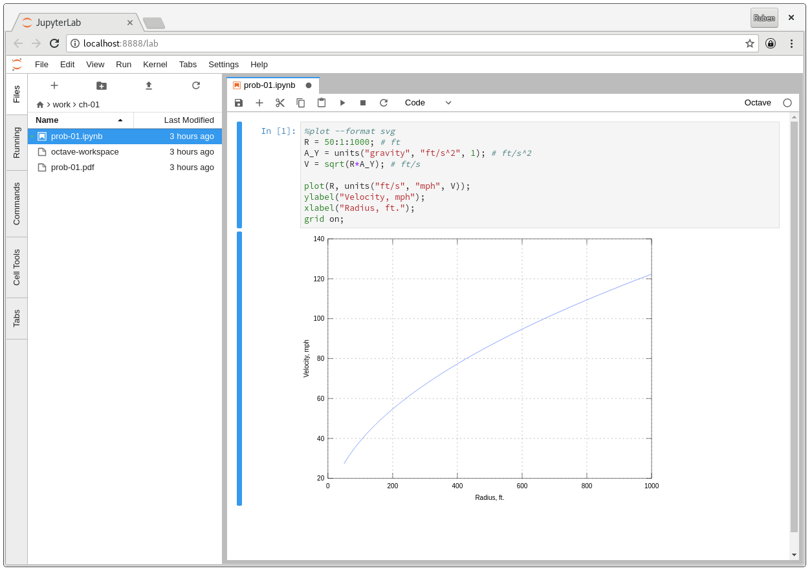

# Jupyter lab with an Octave kernel

Instructions are the same as the [Minimal Jupyter Notebook Stack](https://github.com/jupyter/docker-stacks/tree/master/minimal-notebook) for running this image (on which this is based).

Use `docker.io/rubenv/jupyter-octave` as the image name.

## Known issues

If you're getting black plots, add the following: `%plot --format svg`.
